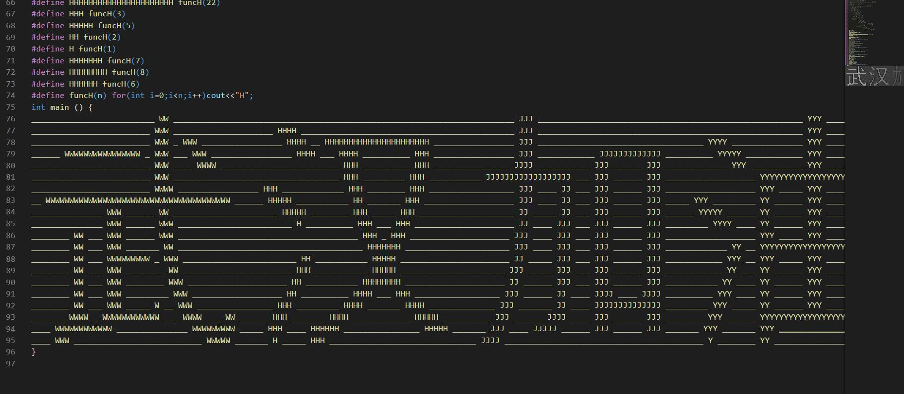
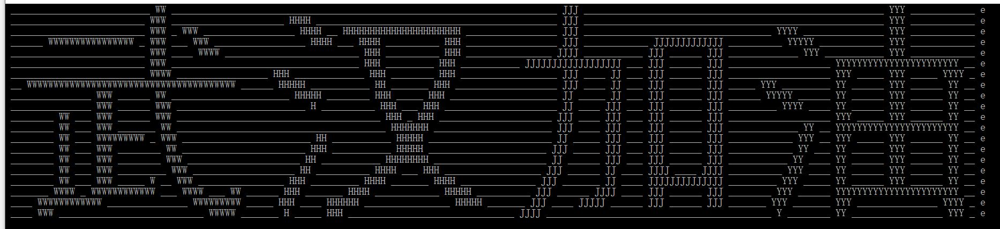

# 武汉加油

网上逛的时候看见个代码与输出一样的程序，甚感惊奇

受它启发，值此肺炎疫情我也写个主函数代码与输出一样的程序为**武汉加油**！

代码请看main.cpp

其输出如下，与主函数内代码一模一样

## 制作方法

先在[https://www.ascii-art-generator.org/](https://www.ascii-art-generator.org/)上传“武汉加油”的图片，它会生成一幅字符画，下载后稍加编辑，就是本仓库的banner.txt

随后用我编写的convert.py读取banner.txt生成一个main.cpp，这个main.cpp就是上图的程序了，输出与主函数代码一样

convert.py具有较强通用性，只需由除了e与下划线外的字符代表字符画，下划线代表空，e放在每行最后代表换行，即可用来生成一个代码与输出一样的程序

## DONATE

